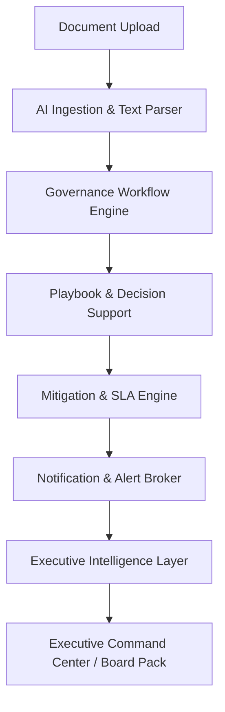

# Enterprise Governance Intelligence Platform

[](https://www.python.org/)
[](https://fastapi.tiangolo.com/)
[](https://reactjs.org/)
[](https://www.typescriptlang.org/)
[](https://vitejs.dev/)
[](https://tailwindcss.com/)

The **Enterprise Governance Intelligence Platform** is a portfolio-grade executive decision-support system designed to turn mixed-format unstructured project governance documents into structured, actionable intelligence. It ingests steering packs, status memos, meeting minutes, and RAID logs, applies ontology-aware AI extraction, runs deterministic playbooks, tracks SLA remediations, isolates tenant scopes, and presents a boardroom command center dashboard.

---

## 1. Core Capabilities

- **Governance Workflows**: Automates mixed-format ingestion (PDF, DOCX, TXT, XLSX, scanned PDF with OCR fallback), classifies report intent, and manages draft statuses (Draft, Manager Review, Approval, Changes Requested).
- **Risk Management**: Captures risks, issues, action items, and dependencies (RAID) with dynamic 0-100 severity scoring and AI-driven explainability traces.
- **Escalations Lifecycle**: Supports Manager-initiated issue escalations to leadership, routing targets, and lead-only resolutions or closures.
- **Mitigation Tasks**: Translates risk recommendations into tracking tasks with ownership, progress sliders, and effectiveness scales. Reduces residual risk down to a strictly enforced 20% floor limit.
- **Notification Engine**: Handles event-driven notifications (assignments, status changes) and pull-based warnings (due soon, overdue task SLA breaches).
- **Multi-Tenancy**: Guarantees organizational data isolation at the database layer using interceptors parsing `X-Tenant-ID` headers.
- **AI Recommendations**: Employs an abstract LLM interface (Claude or Mock Provider) to generate contextual relevance context, mitigations advice, and impact metrics.
- **Executive Intelligence**: PowerBI/Splunk-style command center dashboard calculating health indicators, maturity dimensions, industry average percentiles, root causes, and printable board pack summaries.

---

## 2. High-Level System Architecture

The following diagram illustrates the data flow through the platform:



- For detail-level diagrams and entity relationships, see [docs/architecture/system_design.md](docs/architecture/system_design.md).
- To examine the relational database layout, see [docs/architecture/domain_model.md](docs/architecture/domain_model.md).

---

## 3. Local Setup & Quick Start

### Prerequisites
- **Python**: 3.14+
- **Node.js**: 20+

### Step 1: Clone and Set Up the Backend
```bash
# Navigate to project and create virtual environment
python -m venv .venv
source .venv/bin/activate  # On Windows: .\.venv\Scripts\Activate.ps1

# Install requirements and run database migration
pip install -r requirements.txt
python -m backend.app.migrations

# Start the FastAPI API server
uvicorn backend.app.main:app --reload
```
The backend API documentation is available at `http://localhost:8000/docs`.

### Step 2: Set Up the Frontend
```bash
# Navigate and install dependencies
cd frontend
npm install

# Start local React Vite dev server
npm run dev
```
The UI dashboard is available at `http://localhost:5173/`.

### Step 3: Seeding the Demo Environment
1. Switch your active role in the sidebar dropdown to **Governance Lead** or **Manager**.
2. Click the **Generate Demo Data** button in the dashboard's seeder panel.
3. Select the **Global Enterprise** size preset and click generate.
4. Confirm that all lists, notifications, and graphs are fully populated.

---

## 4. Showcase Screenshots

Reference mock screenshots mapping key dashboard views:
- **Operations Dashboard**: [docs/screenshots/dashboard.png](docs/screenshots/dashboard.png)
- **Executive Hub Command Center**: [docs/screenshots/executive-hub.png](docs/screenshots/executive-hub.png)
- **Mitigation Tasks Lifecycle**: [docs/screenshots/mitigations.png](docs/screenshots/mitigations.png)
- **Real-Time Notification Feed**: [docs/screenshots/notifications.png](docs/screenshots/notifications.png)
- **Audited Compliance Reports**: [docs/screenshots/reports.png](docs/screenshots/reports.png)
- **Escalation Disputes Queue**: [docs/screenshots/escalations.png](docs/screenshots/escalations.png)
- **Printable Board Pack PDF**: [docs/screenshots/board-pack.png](docs/screenshots/board-pack.png)
- **Pipeline Architecture Info**: [docs/screenshots/architecture.png](docs/screenshots/architecture.png)
