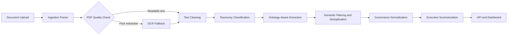

# Enterprise Governance Intelligence Platform

[](https://www.python.org/)
[](https://fastapi.tiangolo.com/)
[](https://streamlit.io/)
[](https://www.docker.com/)

Enterprise Governance Intelligence Platform is a portfolio-grade AI system for turning mixed-format project governance documents into structured executive intelligence. It handles PDFs, scanned PDFs, DOCX, TXT, and XLSX governance registers, then applies ontology-aware extraction, semantic filtering, OCR fallback, and regression evaluation.

This is positioned as an enterprise AI engineering platform, not an AI PDF summarizer.

## Why This Project Matters

Enterprise delivery teams produce governance information across steering packs, RAID logs, escalation memos, meeting minutes, status reports, and spreadsheets. The hard problem is not reading files; it is separating real governance signal from generic enterprise language. This platform demonstrates a precision-first architecture for classification, extraction, validation, and executive-facing reporting.

## Repository Navigation

| Area | Purpose |
| --- | --- |
| [backend/](backend/README.md) | FastAPI service, ingestion, OCR, classification, extraction, database models |
| [frontend/](frontend/README.md) | Streamlit executive UI and report views |
| [docs/](docs/README.md) | Architecture, ontology, deployment, regression, validation, and roadmap documentation |
| [demo/](demo/walkthrough/demo_walkthrough.md) | Demo walkthrough material and curated sample outputs |
| [scripts/](scripts/) | Setup, deployment, regression, and maintenance automation |
| [data/regression/](data/regression/) | Regression corpus and generated evaluation artifacts |
| [deployment/docker/](deployment/docker/) | Dockerfile and Compose deployment entry points |
| [tests/](tests/) | Unit, integration, and regression tests |

## Enterprise Problems Solved

- Mixed-format governance ingestion across DOCX, PDF, scanned PDF, TXT, and XLSX.
- Governance taxonomy classification for reports, RAID registers, meeting minutes, escalation memos, noisy OCR documents, and generic business documents.
- Ontology-aware extraction for risks, issues, dependencies, actions, decisions, approvals, recommendations, escalations, mitigations, observations, and compliance concerns.
- Precision-first suppression of false positives from policies, manuals, newsletters, and generic business language.
- OCR fallback for low-quality PDF extraction and scanned content.
- Enterprise regression framework with expected JSON validation and metrics reporting.
- Executive UI for governance health, RAID distribution, action ownership, confidence indicators, and explainability.

## Architecture Overview



Detailed documentation:

- [System architecture](docs/architecture/system_architecture.md)
- [Extraction pipeline](docs/architecture/extraction_pipeline.md)
- [OCR pipeline](docs/architecture/ocr_pipeline.md)
- [Governance ontology](docs/ontology/governance_ontology.md)
- [Regression framework](docs/regression/regression_framework.md)

## Showcase Visuals

Visual placeholders and Mermaid source files are organized for GitHub portfolio polish:

- [Architecture diagrams](docs/assets/diagrams/)
- [Dashboard screenshot placeholders](docs/assets/screenshots/)
- [Demo GIF placeholders](docs/assets/gifs/)
- [Logo assets](docs/assets/logos/)

## Supported Formats

- PDF, including scanned and OCR-noisy PDFs
- DOCX and DOC
- TXT
- XLSX governance registers and action logs

## Quick Start

```powershell
python -m venv .venv
.\.venv\Scripts\Activate.ps1
pip install -r requirements.txt
python scripts/setup/migrate.py
python scripts/deployment/run.py
```

Backend:

```powershell
uvicorn backend.app.main:app --reload
```

Frontend:

```powershell
streamlit run frontend/app.py
```

## Regression Evaluation

Run the enterprise corpus evaluation:

```powershell
python scripts/regression/run_regression_tests.py
```

Generated outputs:

- [Regression report](docs/regression/regression_test_report.md)
- [Regression results CSV](docs/regression/regression_results.csv)

## Demo Mode

Load curated demo documents:

```powershell
python scripts/setup/load_demo_dataset.py
```

Then upload documents from [data/demo/](data/demo/) through the Streamlit upload center or API.

## Docker Deployment

```powershell
docker compose -f deployment/docker/docker-compose.yml up --build
```

Deployment docs:

- [Deployment guide](docs/deployment/deployment.md)
- [Deployment checklist](docs/deployment/deployment_checklist.md)

## Testing

```powershell
pytest tests/ -v
python scripts/regression/run_regression_tests.py
```

## Design Decisions

- Preserve production ingestion and OCR as the source of truth for regression testing.
- Prefer semantic precision over raw extraction volume.
- Model governance meaning through an ontology instead of flattening every signal into RAID.
- Keep document classification structure-aware, not keyword-only.
- Keep generated outputs out of the repository root.

## Known Limitations

See [known limitations](docs/validation/known_limitations.md). Current limitations include evolving semantic clustering, limited real-world PMO validation, and an ontology that should expand as more enterprise document types are reviewed.

## Roadmap

See [ROADMAP.md](ROADMAP.md) and [real-world validation plan](docs/validation/real_world_validation_plan.md).
