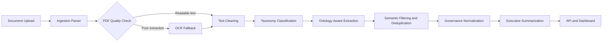

# Enterprise Governance Intelligence Platform

[](https://www.python.org/)
[](https://fastapi.tiangolo.com/)
[](https://streamlit.io/)
[](https://www.docker.com/)

Enterprise Governance Intelligence Platform is a portfolio-grade AI system for turning mixed-format project governance documents into structured executive intelligence. It handles PDFs, scanned PDFs, DOCX, TXT, and XLSX governance registers, then applies ontology-aware extraction, semantic filtering, OCR fallback, and regression evaluation.

This is positioned as an enterprise AI engineering platform, not an AI PDF summarizer.

## Why This Project Matters

Enterprise delivery teams produce governance information across steering packs, RAID logs, escalation memos, meeting minutes, status reports, and spreadsheets. The hard problem is not reading files; it is separating real governance signal from generic enterprise language. This platform demonstrates a precision-first architecture for classification, extraction, validation, and executive-facing reporting.

## Repository Navigation

| Area | Purpose |
| --- | --- |
| [backend/](backend/README.md) | FastAPI service, ingestion, OCR, classification, extraction, database models |
| [frontend/](frontend/README.md) | Streamlit executive UI and report views |
| [docs/](docs/README.md) | Architecture, ontology, deployment, regression, validation, and roadmap documentation |
| [demo/](demo/walkthrough/demo_walkthrough.md) | Demo walkthrough material and curated sample outputs |
| [scripts/](scripts/) | Setup, deployment, regression, and maintenance automation |
| [data/regression/](data/regression/) | Regression corpus and generated evaluation artifacts |
| [deployment/docker/](deployment/docker/) | Dockerfile and Compose deployment entry points |
| [tests/](tests/) | Unit, integration, and regression tests |

## Enterprise Problems Solved

- Mixed-format governance ingestion across DOCX, PDF, scanned PDF, TXT, and XLSX.
- Governance taxonomy classification for reports, RAID registers, meeting minutes, escalation memos, noisy OCR documents, and generic business documents.
- Ontology-aware extraction for risks, issues, dependencies, actions, decisions, approvals, recommendations, escalations, mitigations, observations, and compliance concerns.
- Precision-first suppression of false positives from policies, manuals, newsletters, and generic business language.
- OCR fallback for low-quality PDF extraction and scanned content.
- Enterprise regression framework with expected JSON validation and metrics reporting.
- Executive UI for governance health, RAID distribution, action ownership, confidence indicators, and explainability.

## Architecture Overview



Detailed documentation:

- [System architecture](docs/architecture/system_architecture.md)
- [Extraction pipeline](docs/architecture/extraction_pipeline.md)
- [OCR pipeline](docs/architecture/ocr_pipeline.md)
- [Governance ontology](docs/ontology/governance_ontology.md)
- [Regression framework](docs/regression/regression_framework.md)

## Showcase Visuals

Visual placeholders and Mermaid source files are organized for GitHub portfolio polish:

- [Architecture diagrams](docs/assets/diagrams/)
- [Dashboard screenshot placeholders](docs/assets/screenshots/)
- [Demo GIF placeholders](docs/assets/gifs/)
- [Logo assets](docs/assets/logos/)

## Supported Formats

- PDF, including scanned and OCR-noisy PDFs
- DOCX and DOC
- TXT
- XLSX governance registers and action logs

## Quick Start

```powershell
python -m venv .venv
.\.venv\Scripts\Activate.ps1
pip install -r requirements.txt
python scripts/setup/migrate.py
python scripts/deployment/run.py
```

Backend:

```powershell
uvicorn backend.app.main:app --reload
```

Frontend:

```powershell
streamlit run frontend/app.py
```

## Regression Evaluation

Run the enterprise corpus evaluation:

```powershell
python scripts/regression/run_regression_tests.py
```

Generated outputs:

- [Regression report](docs/regression/regression_test_report.md)
- [Regression results CSV](docs/regression/regression_results.csv)

## Demo Mode

Load curated demo documents:

```powershell
python scripts/setup/load_demo_dataset.py
```

Then upload documents from [data/demo/](data/demo/) through the Streamlit upload center or API.

## Docker Deployment

```powershell
docker compose -f deployment/docker/docker-compose.yml up --build
```

Deployment docs:

- [Deployment guide](docs/deployment/deployment.md)
- [Deployment checklist](docs/deployment/deployment_checklist.md)

## Cloud Deployment: Streamlit + Render

Deploy the frontend to Streamlit Cloud and backend to Render with environment-based API configuration:

### Architecture

```
┌─────────────────┐                    ┌──────────────────┐
│ Streamlit Cloud │ ────── API ─────→  │  Render Backend  │
│   (Frontend)    │   (HTTPS/REST)     │   (FastAPI)      │
└─────────────────┘                    └──────────────────┘
```

### Prerequisites

- **GitHub repository** with code committed
- **Streamlit Cloud account** (free at https://share.streamlit.io)
- **Render account** (free at https://render.com)
- Backend Docker image or code for Render deployment

### Backend Deployment (Render)

1. **Create a Web Service on Render**:
   - Go to https://dashboard.render.com
   - Click "New +" → "Web Service"
   - Connect your GitHub repository
   - Settings:
     - **Name**: `enterprise-ai-backend`
     - **Runtime**: `Python 3.11`
     - **Build Command**: `pip install -r requirements.txt`
     - **Start Command**: `uvicorn backend.app.main:app --host 0.0.0.0 --port 8080`
     - **Environment**: Add any required secrets (e.g., API keys)

2. **After deployment**, note the service URL (e.g., `https://enterprise-ai-backend.onrender.com`)

### Frontend Deployment (Streamlit Cloud)

1. **Connect GitHub Repository**:
   - Go to https://share.streamlit.io
   - Click "New app"
   - Select your GitHub repository
   - Set:
     - **Repository**: `your-org/enterprise-governance-intelligence-platform`
     - **Branch**: `main` (or your deployment branch)
     - **Main file path**: `frontend/app.py`

2. **Configure Secrets**:
   - In your app's settings (top-right menu), click "Advanced settings"
   - Go to the "Secrets" section
   - Add:
     ```toml
     API_BASE_URL = "https://enterprise-ai-backend.onrender.com"
     ```
   - Click "Save"

3. **Deploy**:
   - Streamlit Cloud will automatically deploy
   - Access your frontend at `https://<your-username>-enterprise-ai.streamlit.app`

### Verify Deployment

1. **Check Backend Health**:
   ```bash
   curl https://enterprise-ai-backend.onrender.com/health
   ```

2. **Check Frontend**:
   - Open the frontend URL in a browser
   - Navigate to the Dashboard
   - Look for "📡 Backend" in the sidebar
   - Verify it shows your Render backend URL

3. **Test Upload**:
   - Go to "Upload Center"
   - Upload a test document
   - Verify the pipeline processes successfully

### Environment Variables

#### Backend (Render)

Set these in Render's environment:
```env
DATABASE_URL=your-database-url
OPENAI_API_KEY=your-api-key
LOG_LEVEL=info
```

#### Frontend (Streamlit Cloud)

Set in Streamlit Cloud Secrets:
```toml
API_BASE_URL = "https://your-render-backend.onrender.com"
```

### Configuration Reference

| Setting | Local Dev | Production |
|---------|-----------|-----------|
| **Frontend Host** | `localhost:8501` | `https://<app-name>.streamlit.app` |
| **Backend Host** | `localhost:8000` | `https://<app-name>.onrender.com` |
| **API Base URL** | `http://localhost:8000` | `https://<app-name>.onrender.com` |
| **Configuration** | `.streamlit/secrets.toml` | Streamlit Cloud Secrets |

### Troubleshooting

#### "Cannot connect to backend"

1. **Verify Render deployment is active**:
   ```bash
   curl https://your-backend.onrender.com/health
   ```

2. **Check Streamlit Cloud Secrets**:
   - Go to app settings → "Secrets"
   - Verify `API_BASE_URL` is set and correct
   - No typos in the URL

3. **Check CORS on backend**:
   - Ensure FastAPI has CORS middleware enabled for Streamlit Cloud origin
   - Expected: `CORSMiddleware(app, allow_origins=["*"])`

4. **Verify Render logs**:
   - In Render dashboard, check the backend service logs
   - Look for startup errors or connection issues

#### Timeout Errors

- Check backend performance in Render logs
- May need to increase timeout in `frontend/config.py`'s `make_api_request(timeout=10)`
- Render free tier may have cold starts; consider upgrading plan

#### Secret Not Found

- Confirm secret is saved in Streamlit Cloud (not just Render)
- Click "Save" when adding secrets
- Secrets are encrypted and take ~30 seconds to propagate
- Force a rerun after saving secrets

### Cost Considerations

- **Streamlit Cloud**: Free tier available (Community)
- **Render**: Free tier with limitations (spins down after 15 min inactivity)
- For production: Consider upgrading Render to a paid plan for always-on service

### Customization

#### Change API Timeout

Edit `frontend/config.py`:
```python
def make_api_request(..., timeout: int = 10):
    # Change timeout to 30 for slower backends
    response = requests.request(method, url, timeout=timeout, **kwargs)
```

#### Add Additional Secrets

Update `.streamlit/secrets.toml.example` and Streamlit Cloud Secrets:
```toml
API_BASE_URL = "https://your-backend.onrender.com"
LOG_LEVEL = "info"
CUSTOM_SETTING = "value"
```

Access in code:
```python
import streamlit as st
custom_value = st.secrets.get("CUSTOM_SETTING", "default")
```

## Testing

```powershell
pytest tests/ -v
python scripts/regression/run_regression_tests.py
```

## Design Decisions

- Preserve production ingestion and OCR as the source of truth for regression testing.
- Prefer semantic precision over raw extraction volume.
- Model governance meaning through an ontology instead of flattening every signal into RAID.
- Keep document classification structure-aware, not keyword-only.
- Keep generated outputs out of the repository root.

## Known Limitations

See [known limitations](docs/validation/known_limitations.md). Current limitations include evolving semantic clustering, limited real-world PMO validation, and an ontology that should expand as more enterprise document types are reviewed.

## Roadmap

See [ROADMAP.md](ROADMAP.md) and [real-world validation plan](docs/validation/real_world_validation_plan.md).
