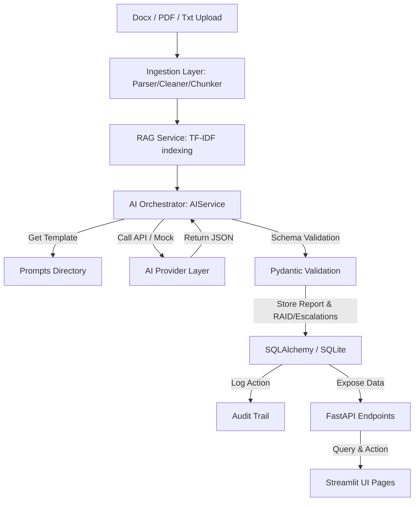

# System Architecture Documentation

This document describes the architectural layout, data flow, and design patterns implemented in the Enterprise AI Governance & Operations Copilot.

---

## 1. System Topology & Data Flow

The application follows a clean, layered architecture separating concerns between file ingestion, retrieval-augmented generation (RAG), AI orchestration, database persistence, REST APIs, and a Streamlit-based presentation layer.

### End-to-End Processing Steps:
1. **Ingest & Parse**: Documents are uploaded via `Upload Center` and saved to `data/uploads/`. The `parser.py` extracts text and table contents.
2. **Text Processing**: `cleaner.py` removes junk spacing and invalid characters. `chunker.py` divides the text into overlapping segments based on configuration.
3. **Retrieval (RAG)**: If RAG is enabled, the TF-IDF module (`retrieval.py`) builds a temporary document frequency index and ranks chunks against query terms (e.g. searching for risks, milestones) to assemble the most relevant context.
4. **AI Generation**: The `AIService` loads prompt templates, appends context, and queries the selected `AIProvider`. 
5. **Validation**: The JSON payload is deserialized and validated against `AIReportExtractionSchema` to guarantee schema compliance.
6. **DB Transaction**: The background worker saves the report. If a previous report exists for the document, `is_latest` is set to `False` on the older record, and a new version is created. An `AuditLog` entry is appended.

---

## 2. Core Components

### A. Ingestion Layer (`backend/app/services/ingestion/`)
- **Parser (`parser.py`)**: Uses `python-docx` for `.docx` and `pypdf` for `.pdf` files. Extracts paragraphs and table rows.
- **Cleaner (`cleaner.py`)**: Standardizes whitespace, removes control codes, and formats plain text blocks.
- **Chunker (`chunker.py`)**: Performs sliding-window splitting using `CHUNK_SIZE` and `CHUNK_OVERLAP` characters.

### B. RAG Retrieval (`backend/app/services/rag/`)
- **Vector-less TF-IDF (`retrieval.py`)**: Uses standard library math (`math.log`, `math.sqrt`) to calculate term frequencies, document frequencies, and cosine similarity between search terms and chunks. Ensures 100% availability across all platform setups without requiring external C-extensions, vector databases, or API calls.

### C. AI Service Layer (`backend/app/services/ai/`)
- **Base Provider (`provider.py`)**: Abstract base class defining the required contract for extraction models.
- **Anthropic Provider (`anthropic_provider.py`)**: Connects to Claude using system prompts, templates, and temperature settings. Employs response formatting guidelines to force valid JSON structures.
- **Mock Provider (`mock_provider.py`)**: For offline development and fallback. Scans the file contents for keywords (like names, vendors, dates, numbers) to populate a realistic schema dynamically.
- **AI Service Orchestrator (`ai_service.py`)**: Acts as a gateway. Implements fallback retry logic and validates Pydantic model configurations.

### D. Workflow Worker (`backend/app/services/workflow.py`)
- Coordinates the entire pipeline inside a FastAPI `BackgroundTasks` thread. Performs transaction rollback on failure, transitions status to `FAILED`, and records errors to `AuditLog`.

---

## 3. Database Schema Layout

The system uses an SQLite database (`data/governance.db`) managed via SQLAlchemy ORM.

### Database Tables:

1. **`User`**: Tracks username and user roles (`analyst`, `reviewer`).
2. **`Document`**: Represents uploaded source files.
   - Fields: `id`, `filename`, `filepath`, `file_type`, `uploaded_at`, `status` (WorkflowStatus: `uploaded`, `processing`, `pending_review`, `approved`, `published`, `failed`).
3. **`WorkflowJob`**: Monitors background task states and captures execution logs.
   - Fields: `id`, `document_id`, `status`, `logs`, `created_at`, `updated_at`.
4. **`GovernanceReport`**: Houses the extracted summary, executive notes, and audit fields.
   - Fields: `id`, `document_id`, `summary`, `executive_summary`, `confidence_score`, `model_version`, `review_status`, `reviewer`, `review_notes`, `processing_time_seconds`, `tokens_used`, `provider_name`, `version`, `is_latest`, `created_at`, `updated_at`.
5. **`RaidItem`**: Holds granular risks, actions, issues, and dependencies.
   - Fields: `id`, `report_id`, `type` (Risk/Action/Issue/Dependency), `description`, `severity`, `confidence_score`, `source_excerpt`.
6. **`EscalationItem`**: Contains flagged high-severity items requiring routing.
   - Fields: `id`, `report_id`, `description`, `severity`, `status` (`open`, `routed`), `routing_target`, `confidence_score`, `source_excerpt`.
7. **`AuditLog`**: Central tracking repository for all user and system transactions.
   - Fields: `id`, `document_id`, `governance_report_id`, `event`, `user`, `details`, `timestamp`.

---

## 4. Key Design Patterns

### A. Factory Pattern (AI Providers)
The `AIService` dynamically instantiates the correct provider (`MockProvider` or `AnthropicProvider`) based on the environment configurations, isolating API client interactions.

### B. Unit of Work / Repository
FastAPI dependency injection yields localized `SessionLocal` database handlers to endpoints, ensuring that sessions are opened/closed cleanly per HTTP request.

### C. Pessimistic Locking & Version Control (Report Iterations)
When a reviewer requests changes, a new report record is created on the next extraction block with `version = previous_version + 1` and `is_latest = True`. The old report record updates `is_latest = False`. The database retains the complete audit-history chain of governance insights.
