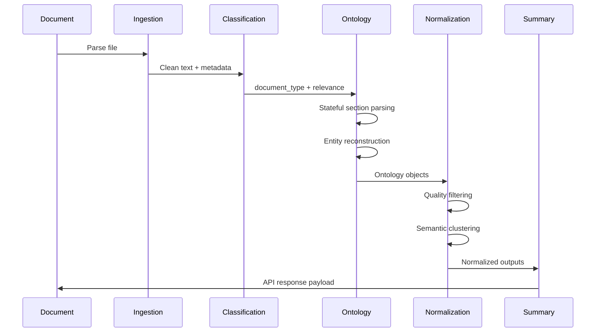

# Extraction Pipeline

## Pipeline Stages

## Stage Responsibilities

1. Ingestion: extract text from supported file formats.
2. Classification: route by document intent and governance density.
3. Section parsing: maintain current section and governance context.
4. Object reconstruction: assemble rows and field blocks into one entity.
5. Semantic filtering: reject headings, separators, fragments, policy obligations, and commentary.
6. Deduplication: cluster semantically equivalent items.
7. Projection: map ontology types into legacy API fields.
8. Summarization: generate executive-facing governance narrative.

## Traceability

Each projected item includes:

- type
- description
- severity
- confidence score
- source excerpt

## Precision Bias

The platform intentionally prefers missing a weak item over fabricating or over-extracting governance entities. This is especially important for meeting actions and escalations.

