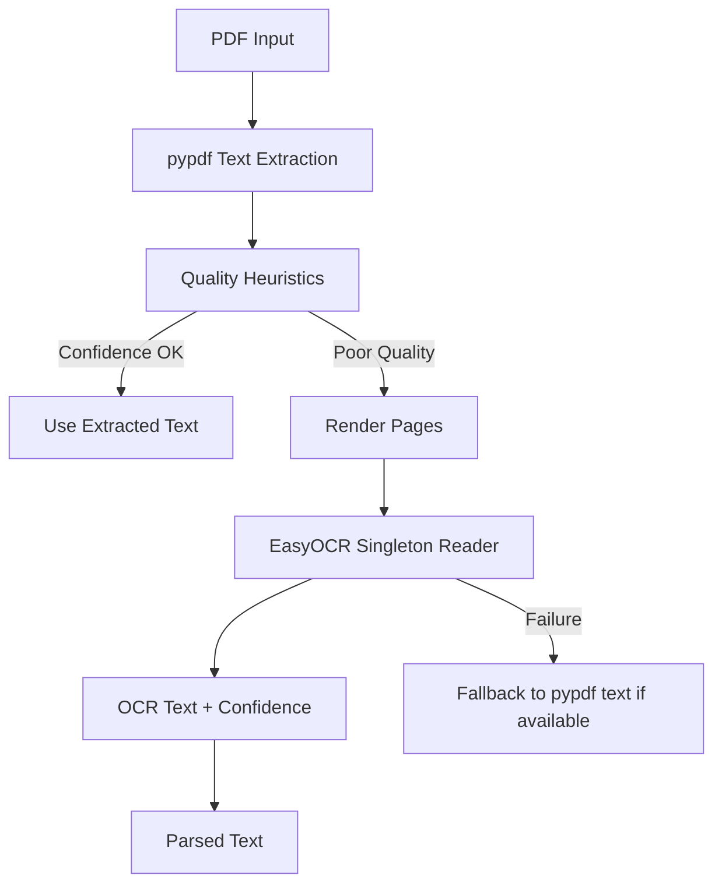

# OCR Pipeline

## Overview

PDF ingestion attempts searchable text extraction first. OCR fallback is used only when text quality heuristics indicate poor extraction.

## Quality Signals

- text density
- malformed spacing
- symbol/noise ratio
- short extraction for multi-page PDF
- OCR-noise spellings such as `Govemance`, `Esca1ation`, `Dependencles`

## Operational Safeguards

- `MAX_OCR_PAGES` limits OCR work.
- EasyOCR reader is singleton cached.
- Rendered pages are converted to supported EasyOCR inputs.
- OCR fallback errors are logged and do not discard usable pypdf text.

