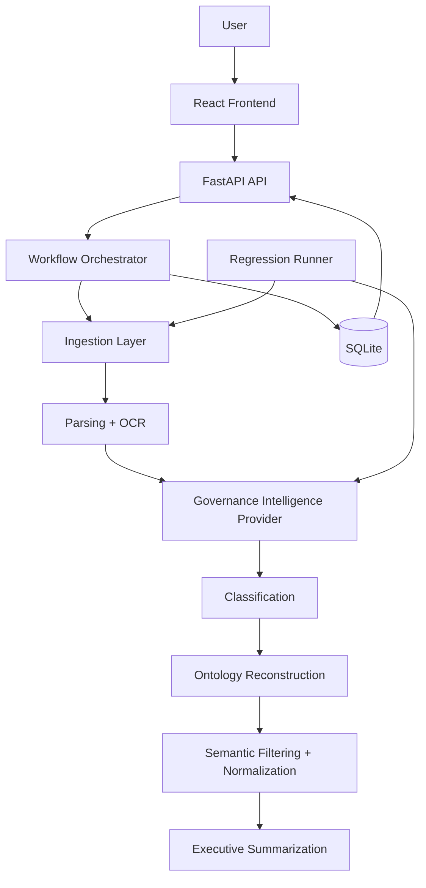

# System Architecture

## Overview

The platform is a FastAPI backend with a React (Vite + TypeScript) governance frontend. It ingests enterprise documents, extracts text, classifies document intent, reconstructs governance ontology entities, stores results in SQLite, and presents review workflows in a React UI.

## Runtime Components

| Component | Responsibility |
| --- | --- |
| `backend/app/main.py` | FastAPI app boot, startup checks, router mounting |
| `backend/app/api/endpoints.py` | REST API endpoints |
| `backend/app/services/workflow.py` | Document upload and report generation workflow |
| `backend/app/services/ingestion/parser.py` | PDF/DOCX/TXT/XLSX parsing and OCR fallback |
| `backend/app/services/ai/mock_provider.py` | Governance intelligence extraction in local/mock mode |
| `backend/app/services/governance/ontology.py` | Shared ontology vocabulary and thresholds |
| `frontend/` | React + Vite + TypeScript app and review pages |
| `scripts/regression/run_regression_tests.py` | Corpus evaluation framework |

## Data Stores

- SQLite database: `data/governance.db`
- Uploaded files: `data/uploads/`
- RAG store: `data/rag_store.json`
- Regression outputs: `docs/regression/regression_test_report.md`, `docs/regression/regression_results.csv`

## API Compatibility

The current public API continues to return legacy fields:

- `raid_items`
- `escalation_items`
- `meeting_actions`
- `document_type`
- `governance_relevance`
- confidence fields

Internally, extraction now uses richer ontology semantics before projecting to these API fields.
