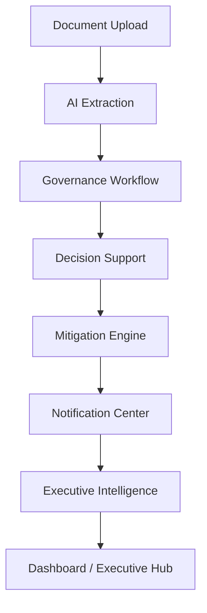
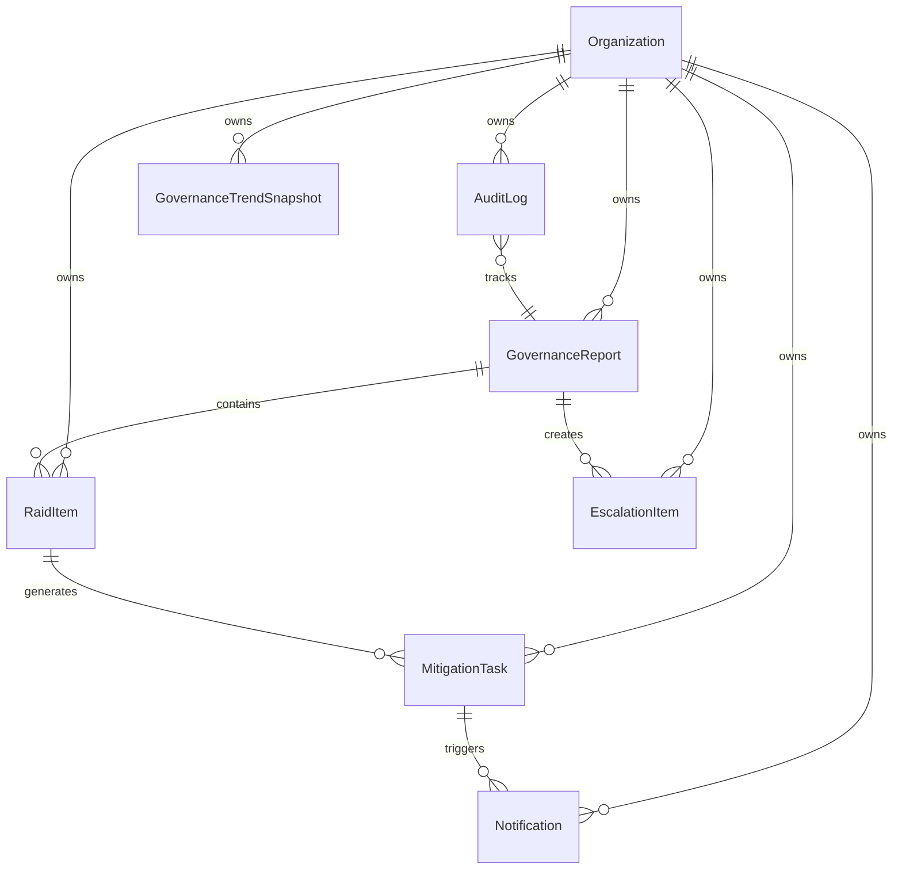

# System Design — Enterprise Governance Intelligence Platform

This document describes the end-to-end technical system design and architecture of the Enterprise Governance Intelligence Platform (v1.0.0-rc1).

---

## 1. High-Level Architecture Flow

The system behaves as an event-driven pipelines orchestration:
1. **Document Upload**: Users upload compliance drafts and minutes.
2. **AI Extraction**: Text parser extracts content and forwards it to the AI Service (Claude or mock) to produce structured metadata.
3. **Governance Workflow**: Extracted entities are saved as drafts, reviewable by Managers and routed/escalated as needed.
4. **Decision Support**: Playbooks classify severity, compute risk scores, and recommend mitigations/owners.
5. **Mitigation Engine**: Converts playbook actions into tracked compliance tasks with SLA target dates.
6. **Notification Center**: Pulls target dates and triggers event-driven/time-driven notifications for owners.
7. **Executive Intelligence**: Aggregates data from the underlying engines to calculate health indices, maturity dimensions, root causes, and briefings.
8. **Dashboard / Executive Hub**: Provides the final boardroom command center visual controls, exports, and AI Copilot.

---

## 2. Entity Relationship Diagram

The database structure maps core multi-tenant compliance entities:

- **Organization (Tenant)**: The isolation boundary. All reports, items, tasks, logs, and trends belong to a single Organization.
- **GovernanceReport**: The extracted metadata container for an ingested file.
- **RaidItem**: A specific risk, action, issue, or dependency linked to a report.
- **EscalationItem**: A corporate dispute escalated to leadership.
- **MitigationTask**: An actionable task assigned to an owner to remediate a RAID item.
- **Notification**: Alert triggered for state transitions or overdue dates.
- **AuditLog**: Chronological record tracking all platform operations.
- **GovernanceTrendSnapshot**: Daily snapshot recording health, maturity, and risk trends.

---

## 3. Subsystem Architecture

### Frontend
- **Framework**: React 18, Vite, TypeScript, TailwindCSS.
- **State & Queries**: `@tanstack/react-query` manages API cache states and background polling.
- **UI Components**: Shadcn UI slots (Card, Button), custom CSS print stylesheets, and custom responsive SVG visualizers.

### API Layer
- **Framework**: FastAPI (Python 3.14).
- **Security & Tenancy**: Dependency injection overrides query headers using `X-Tenant-ID` and `X-User-Role` to guarantee data isolation and simulate permissions.

### Ingestion & Workflow Engine
- **Parsing**: `parser.py` supports PDF, DOCX, XLSX, and TXT files, with an OCR engine fallback for scanned documents.
- **State transitions**: `workflow.py` guides reports from Draft -> Pending Manager Review -> Approved / Changes Requested.

### Decision Support & Playbook Engine
- **Playbook Matcher**: Rules-based engine mapping risk text keywords to recommended mitigations and owner roles.
- **Scoring**: Computes numeric severity weights and confidence scores to derive a 0-100 original risk rating.

### Mitigation & SLA Engine
- **Remediation**: Tracks mitigation task lifecycle (Planned, In Progress, Blocked, Completed, Verified).
- **Residual Risk**: Completed and verified tasks dynamically decrease a RAID item's risk score (strictly limited to a 20% residual floor).
- **SLA tracking**: Dynamic target-date checks flag tasks as `ON_TRACK`, `AT_RISK`, or `OVERDUE`.

### Notification Engine
- **Event Alerts**: Dispatched on task assignments or escalation creation.
- **Time Alerts**: Pulls active tasks and generates warnings for tasks due soon or overdue.

### Executive Intelligence Layer
- **Maturity Calculator**: Measures average of 5 compliance metrics.
- **Trends snapshot**: Persists historical snapshot timelines.
- **Briefing Generator**: Creates summaries and markdown documents.
- **Copilot Assistant**: Leverages AIService text completion injected with active tenant stats context to assist leadership in natural language.

---

## 4. Key Cross-Cutting Architectures

### Multi-Tenancy Model
Data isolation is enforced at the database query level. The API gateway extracts the active `tenant_id` from the `X-Tenant-ID` header. Every DB request filters records using `Model.tenant_id == tenant_id`, ensuring completely isolated datasets.

### AI Integration Architecture
The platform isolates the database from raw AI executions. All prompts injected into the AI Provider (Claude or Mock Provider) are constructed inside services using structured context objects, protecting database models from direct model manipulation.

### Export Architecture
Risk registers are extracted to CSV and XLSX. The spreadsheet export uses `openpyxl` to build formatted worksheets including compliance status, risk scores, and audit lists.
