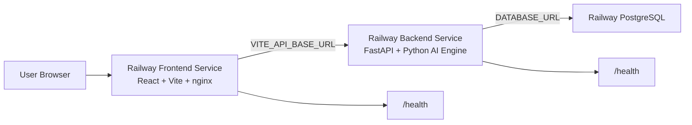

# Railway Deployment Guide

This guide deploys the platform as three Railway services in one project:

- React frontend service
- FastAPI backend service
- Railway PostgreSQL service

The AI extraction engine, OCR pipeline, governance ontology, and API contracts remain unchanged.

## Target Architecture



## Service Setup

### 1. PostgreSQL

1. Create a Railway project.
2. Add a PostgreSQL database service.
3. Railway exposes the database connection as `DATABASE_URL`.

### 2. Backend Service

Create a new Railway service from the GitHub repository.

Recommended settings:

- Root directory: `backend`
- Build method: Dockerfile
- Dockerfile: `backend/Dockerfile`
- Health check path: `/health`

Set backend variables from [backend.env.example](../../deployment/railway/backend.env.example):

```env
APP_NAME="Enterprise AI Governance & Operations Copilot"
DEBUG=false
DATABASE_URL="${{Postgres.DATABASE_URL}}"
UPLOAD_DIR=/app/data/uploads
FRONTEND_ORIGIN=https://your-frontend-service.up.railway.app
CORS_ORIGINS=https://your-frontend-service.up.railway.app
CORS_ALLOW_CREDENTIALS=false
CHUNK_SIZE=1000
CHUNK_OVERLAP=200
USE_RAG=true
USE_MOCK_MODE=true
AI_PROVIDER=mock
ANTHROPIC_API_KEY=
```

Startup command is provided by the Dockerfile:

```bash
uvicorn backend.app.main:app --host 0.0.0.0 --port ${PORT:-8000}
```

### 3. Frontend Service

Create a second Railway service from the same GitHub repository.

Recommended settings:

- Root directory: `frontend`
- Build method: Dockerfile
- Dockerfile: `frontend/Dockerfile`
- Health check path: `/health`

Set frontend variables from [frontend.env.example](../../deployment/railway/frontend.env.example):

```env
VITE_API_BASE_URL=https://your-backend-service.up.railway.app
```

The frontend Dockerfile builds the Vite app and serves it with nginx. Client-side routing is handled by nginx SPA fallback.

## CORS Strategy

The backend reads CORS configuration from environment variables:

- `FRONTEND_ORIGIN`: primary frontend URL
- `CORS_ORIGINS`: comma-separated allowed origins
- `CORS_ALLOW_CREDENTIALS`: defaults to `false`

For Railway production, set both `FRONTEND_ORIGIN` and `CORS_ORIGINS` to the deployed frontend URL.

For local development, the defaults allow:

- `http://localhost:5173`
- `http://localhost:3000`
- `http://localhost:8501`

## Health Checks

Backend:

```bash
curl https://your-backend-service.up.railway.app/health
```

Frontend:

```bash
curl https://your-frontend-service.up.railway.app/health
```

Expected response:

- Backend returns JSON with service status, AI provider, and database dialect.
- Frontend returns `healthy`.

## Local Validation

Validate backend variables:

```powershell
python scripts/deployment/validate_env.py backend --env-file .env.example
```

Validate frontend variables:

```powershell
python scripts/deployment/validate_env.py frontend --env-file frontend/.env.example
```

Build React locally:

```powershell
npm --prefix frontend run build
```

Run local split-service Docker:

```powershell
docker compose -f deployment/docker/docker-compose.yml up --build
```

Local endpoints:

- Frontend: `http://localhost:3000`
- Backend: `http://localhost:8000`

## Deployment Order

1. Deploy PostgreSQL.
2. Deploy backend with `DATABASE_URL` linked to PostgreSQL.
3. Verify backend `/health`.
4. Deploy frontend with `VITE_API_BASE_URL` set to backend public URL.
5. Update backend `FRONTEND_ORIGIN` and `CORS_ORIGINS` to the frontend public URL.
6. Redeploy backend if Railway does not restart automatically after variable changes.

## Troubleshooting

### Frontend loads but API calls fail

- Confirm `VITE_API_BASE_URL` points to the public backend URL.
- Confirm the backend allows the frontend URL in `CORS_ORIGINS`.
- Confirm the backend `/health` endpoint returns `200`.

### Backend fails at startup

- Confirm `DATABASE_URL` is present.
- Confirm the Postgres variable reference is linked to the correct Railway database service.
- Check Railway logs for schema initialization or dependency errors.

### Health check fails

- Backend must listen on Railway's `$PORT`.
- Frontend nginx must listen on Railway's `$PORT`.
- Both Dockerfiles are already configured for this behavior.

