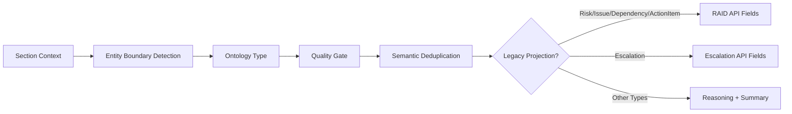

# Governance Ontology

## Purpose

The ontology prevents enterprise governance semantics from collapsing into only RAID and meeting actions. It models the role of each extracted concept before deciding whether it should be exposed through legacy API fields.

## Ontology Types

| Type | Meaning | Legacy Projection |
| --- | --- | --- |
| Risk | Future condition that may impact delivery | `raid_items[type=risk]` |
| Issue | Current blocker or active problem | `raid_items[type=issue]` |
| Dependency | External prerequisite or approval | `raid_items[type=dependency]` |
| ActionItem | Accountable executable task | `raid_items[type=action]` and/or `meeting_actions` |
| Decision | Governance decision or resolution | retained for reasoning |
| Recommendation | Proposed path or advisory statement | retained for reasoning |
| Approval | Formal approval or authorization | retained for reasoning |
| Escalation | Active executive or authority escalation | `escalation_items` |
| Observation | Discussion or informational note | not projected |
| StatusUpdate | Status or progress statement | not projected |
| Mitigation | Risk response or control | evidence on parent object |
| Resolution | Closure or remediation result | evidence on parent object |
| GovernanceReview | Review activity or committee checkpoint | retained for reasoning |
| AuditFinding | Audit finding or control gap | future compliance surface |
| ComplianceConcern | Regulatory/control concern | future compliance surface |

## Mapping Flow

## Precision Rules

- Decisions are not converted into RAID actions.
- Approvals are not treated as escalations.
- Recommendations are not meeting actions unless an owner and deliverable are explicit.
- Mitigations and resolutions enrich parent entities rather than becoming standalone findings.
- Generic business policies produce empty governance outputs unless explicit governance-event evidence exists.

