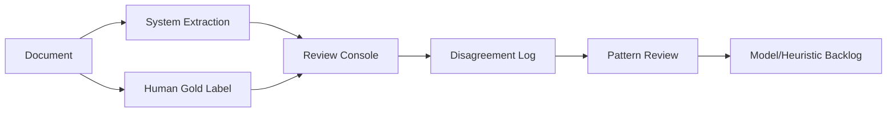

# Real-World Validation Plan

## Objective

Validate governance intelligence quality against realistic PMO, steering committee, RAID, procurement, audit, and meeting artifacts with human review.

## Candidate Data Sources

- Public PMO templates and RAID register examples.
- Steering committee agenda and decision-log templates.
- Procurement status report examples.
- Public audit finding and compliance report samples.
- Anonymized internal governance packs.
- Consulting delivery status packs with sensitive details removed.

## Evaluation Methodology

1. Collect 100-300 representative documents.
2. Remove or anonymize sensitive information.
3. Label document type and governance relevance.
4. Human-review expected ontology entities.
5. Run production ingestion and extraction.
6. Compare output at ontology, legacy API, and executive-summary levels.
7. Record false positives, false negatives, duplicate clusters, and action legitimacy issues.

## Scoring Dimensions

| Dimension | Scoring Approach |
| --- | --- |
| Document classification | exact match |
| Governance relevance | low/medium/high agreement |
| Semantic precision | human-approved extracted entities / extracted entities |
| Semantic recall | human-approved extracted entities / expected entities |
| Action legitimacy | accountable actions only |
| Escalation precision | active escalations only |
| Summary quality | human rating 1-5 |

## Human Review Workflow

## Acceptance Targets

- Governance precision: >= 90%
- Escalation false positive rate: <= 5%
- Action legitimacy precision: >= 85%
- RAID semantic duplicate rate: <= 10%
- Human summary rating: >= 4/5

