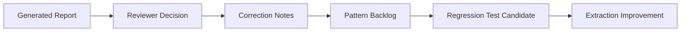

# Reviewer Feedback Workflow

## Purpose

Prepare the platform for future human-in-the-loop validation and correction without implementing a full training loop.

## Review States

- `pending_review`
- `approved`
- `changes_requested`

## Planned Feedback Types

- Incorrect document type
- Incorrect governance relevance
- False positive RAID item
- Missed RAID item
- False escalation
- Missed escalation
- Invalid meeting action
- Missing action owner
- Poor summary quality

## Correction Pipeline Placeholder



## Future Data Model

Potential table:

```text
review_feedback
- id
- report_id
- item_type
- item_id
- feedback_type
- corrected_value
- reviewer
- created_at
```

